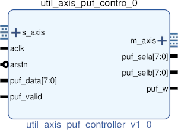

# UTIL AXIS PUF CONTROLLER
## AXIS TO PUF TO AXIS CONTROLLER
---

   author: Jay Convertino   
   
   date: 2022.04.25  
   
   details: Interface string encoder/decoded with PUF core.  
   
   license: MIT   
   
---

### IP USAGE
#### INSTRUCTIONS

This core uses a fixed size for input/output of puf. PUF can be altered, just
add generics to this core to allow matching of sizes (yes I'm being lazy here).

Usage wise this core takes input from the string decoder and controls the PUF core
based upon that. When valid PUF data is feed to the core, and it is in the correct
state, the output is passed to the string encoder.
  
### COMPONENTS
#### SRC

* util_axis_puf_controller.v
  
#### TB

* tb_controller.v
  
### Makefile

* Capable of generating simulations and ip cores for the project.

#### Usage

##### XSim (Vivado)

* make xsim      - Generate Vivado project for simulation.
* make xsim_view - Open Vivado to run simulation.
* make xsim_sim  - Run xsim for a certain amount of time.
  * STOP_TIME ... argument can be passed to change time that the simulation stops (+1000ns, default vivado run time).
  * TB_ARCH ... argument can be passed to change the target configuration for simulation.
* make xsim_gtkwave_view - Use gtkwave to view vcd dump file.

##### IP Core (Vivado)

* make - Create Packaged IP core for Vivado, also builds all sims.
