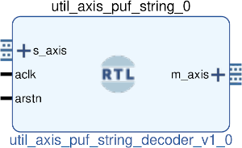

# UTIL AXIS PUF STRING DECODER
## AXIS string to puf decoder
---

   author: Jay Convertino   
   
   date: 2022.04.25  
   
   details: Take a carrige return terminated string and formats it to puf encoder core data input.  
   
   license: MIT   
   
---

### IP USAGE
#### INSTRUCTIONS

This ip core looks for a 11 character carrige return terminated input.   
If the data is not the correct length and not terminated properly it will be ignored.  
If it is correct the data will be parsed in a clock cycle and output to the m_axis   
data output. It's output is compatible with the puf encoder input format for AXIS.  

* FORMAT OF THE STRING:
  * DEST;Hx??;\cr
  * EXAMPLE 1: SELA;Hx55;
  * EXAMPLE 2: START;NOW;
  * DEST = SELA, SELB, START
    * SELA selects register A to write to.
    * SELB selects register B to write to.
    * START tells the puf core to process selects sent.
  * Hx?? data received for SELA/B dest only.
    * 8 bit hex of data to transmit (?? is the data).
  * NOW
    * for start dest only. Really this can be any 3 letter word since it is ignored and only used for padding.
  * \cr each string has a carrige return printed at the end for seperation.

### COMPONENTS
#### SRC

* util_axis_puf_string_decoder.v
  
#### TB

* tb_decoder.v
  
### Makefile

* Capable of generating simulations and ip cores for the project.

#### Usage

##### XSim (Vivado)

* make xsim      - Generate Vivado project for simulation.
* make xsim_view - Open Vivado to run simulation.
* make xsim_sim  - Run xsim for a certain amount of time.
  * STOP_TIME ... argument can be passed to change time that the simulation stops (+1000ns, default vivado run time).
  * TB_ARCH ... argument can be passed to change the target configuration for simulation.
* make xsim_gtkwave_view - Use gtkwave to view vcd dump file.

##### IP Core (Vivado)

* make - Create Packaged IP core for Vivado, also builds all sims.
