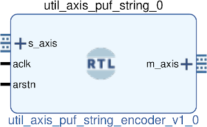

# UTIL AXIS PUF STRING ENCODER
## AXIS PUF to string envoder
---

   author: Jay Convertino   
   
   date: 2022.04.25  
   
   details: Take 8 bit PUF data and convert it to a string.  
   
   license: MIT   
   
---

### IP USAGE
#### INSTRUCTIONS

Take 8 bit data from controller and generate a string. The string  
will have the following format.   

* FORMAT OF THE STRING:
  * ANSR;Hx??;\cr
  * EXAMPLE: ANSR;Hx55;
    * ANSR tells us this is the puf answer to the sela/b and start commands
    * Hx?? data received
      * 8 bit hex of the data word received (?? is the data).
    * \cr each string has a carrige return printed at the end for seperation.

### COMPONENTS
#### SRC

* util_axis_puf_string_encoder.v
  
#### TB

* tb_encoder.v
  
### Makefile

* Capable of generating simulations and ip cores for the project.

#### Usage

##### XSim (Vivado)

* make xsim      - Generate Vivado project for simulation.
* make xsim_view - Open Vivado to run simulation.
* make xsim_sim  - Run xsim for a certain amount of time.
  * STOP_TIME ... argument can be passed to change time that the simulation stops (+1000ns, default vivado run time).
  * TB_ARCH ... argument can be passed to change the target configuration for simulation.
* make xsim_gtkwave_view - Use gtkwave to view vcd dump file.

##### IP Core (Vivado)

* make - Create Packaged IP core for Vivado, also builds all sims.
