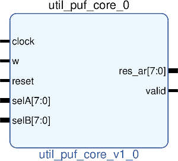

# UTIL PUF CORE
---

   author: AFRL
   
   date: 2022.04.21  
   
   details: Physical Unclonable Function  
   
---

### COMPONENTS
#### SRC

* five_stage_ro.vhd
* PUF_Array.vhd
* PUF_Bit.vhd
* PUF_Comparator.vhd
* PUF_Counter.vhd
* PUF_Decoder.vhd
* PUF_Machine.vhd
* PUF_Main.vhd
* PUF_Mux.vhd
* RO_Array.vhd

  
#### TB

* tb_puf_core.vhd
  
#### Makefile

* Capable of generating simulation projects for Xsim(Vivado).
* Generates library IP (make with no target).

##### Usage

###### XSim (Vivado)

* make xsim      - Generate Vivado project for simulation.
* make xsim_view - Open Vivado to run simulation.
* make xsim_sim  - Run xsim for a certain amount of time.
  * STOP_TIME ... argument can be passed to change time that the simulation stops (+1000ns, default vivado run time).
  * TB_ARCH ... argument can be passed to change the target configuration for simulation.
* make xsim_gtkwave_view - Use gtkwave to view vcd dump file.

##### IP Core (Vivado)

* make - Create packaged IP core for Vivado, also builds all sims.
