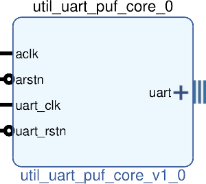

# UTIL UART PUF CORE
## Wrapper for all UART PUF cores
---

   author: Jay Convertino   
   
   date: 2022.04.25  
   
   details: Wrapper for all UART to PUF cores. Allows for simple insertion into projects.  
   
   license: MIT   
   
---

### IP USAGE
#### INSTRUCTIONS

Core contains all the pieces needed to interface with a buf using a UART.

#### PARAMETERS
* clock_speed : DEFAULT = 2000000 : Clock speed of aclk in hz.
* uart_baud_clock_speed : DEFAULT = 2000000 : Clock speed of the uart gen clock in hz.
* uart_baud_rate : DEFAULT = 2000000 : Target baud rate for UART in hz.
* uart_parity_ena : DEFAULT = 1 : Enable uart parity.
* uart_parity_type : DEFAULT = 1 : Set the parity type, 0 = even, 1 = odd, 2 = mark, 3 = space.
* uart_stop_bits : DEFAULT = 1 : Number of stop bits, 0 to crazy non-standard amounts.
* uart_data_bits : DEFAULT = 8 : Number of data bits, 1 to crazy non-standard amounts.
* uart_rx_delay : DEFAULT = 3 : Delay in rx read. Should be middle of input data (baud_clock_speed/baud_rate/2).

### COMPONENTS
#### SRC

* util_uart_puf_core.v
  
#### TB

* tb_core.v
  
### Makefile

* Capable of generating simulations and ip cores for the project.

#### Usage

##### XSim (Vivado)

* make xsim      - Generate Vivado project for simulation.
* make xsim_view - Open Vivado to run simulation.
* make xsim_sim  - Run xsim for a certain amount of time.
  * STOP_TIME ... argument can be passed to change time that the simulation stops (+1000ns, default vivado run time).
  * TB_ARCH ... argument can be passed to change the target configuration for simulation.
* make xsim_gtkwave_view - Use gtkwave to view vcd dump file.

##### IP Core (Vivado)

* make - Create Packaged IP core for Vivado, also builds all sims.
